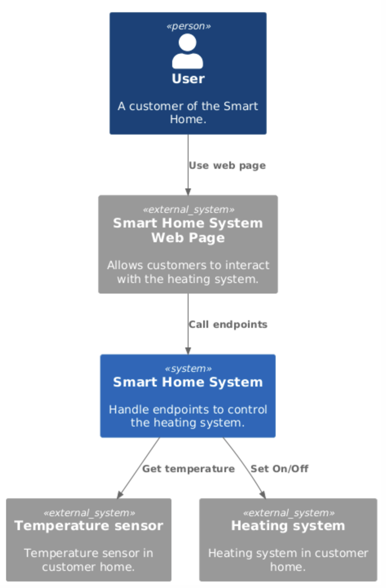
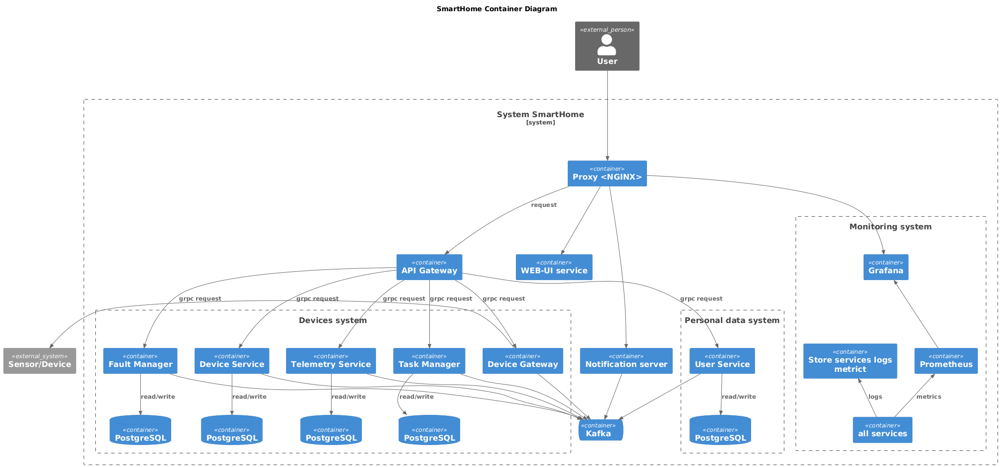
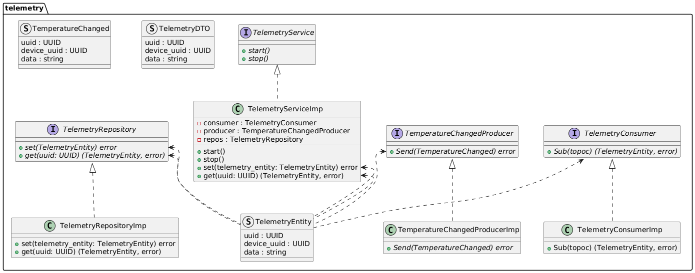
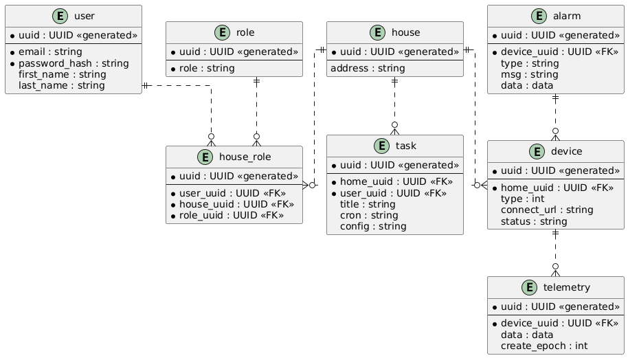

# Задание 1. Анализ и планирование

### 1. Описание функциональности монолитного приложения

**Управление отоплением:**

- Пользователи могут включение/выключение отопления
- Пользователи могут установка температуры
- Система поддерживает автоматическое поддержание температуры

**Мониторинг температуры:**

- Система поддерживает температуры с датчиков
- Система отображает температуру пользователю

### 2. Анализ архитектуры монолитного приложения

- Язык программирования: Java
- База данных: PostgreSQL
- Архитектура: Монолитная, все компоненты системы (обработка запросов, бизнес-логика, работа с данными) находятся в рамках одного приложения.
- Взаимодействие: Синхронное, запросы обрабатываются последовательно.
- Масштабируемость: Ограничена, так как монолит сложно масштабировать по частям.
- Развёртывание: Требует остановки всего приложения.

### 3. Определение доменов и границы контекстов

Домены:

- Пользователь
- Телеметрия
- Сценарии и автоматизации
- Логгирование
- Управление устройствами

### **4. Проблемы монолитного решения**

Существующие проблемы:

- Отсутствует идентификации и аунтетификации пользовтятелей
- Отсутствует мониторинг
- Отсутствует история темппературы
- Отсутсвует расположение датчиков
- Отсутствуют сценарии автоматизации
- Отсутствует возможность для пользователей самостоятельного подключения устройств
- Отсутствует восзможность обновления
- Все запросы синхронны
- Параметры конфигурации зафиксированы в коде
- Сложно скалировать

### 5. Визуализация контекста системы — диаграмма С4

# Задание 2. Проектирование микросервисной архитектуры

В этом задании вам нужно предоставить только диаграммы в модели C4. Мы не просим вас отдельно описывать получившиеся микросервисы и то, как вы определили взаимодействия между компонентами To-Be системы. Если вы правильно подготовите диаграммы C4, они и так это покажут.

**Диаграмма контейнеров (Containers)**

**Диаграмма компонентов (Components)**

Добавьте диаграмму для каждого из выделенных микросервисов.

**Диаграмма кода (Code)**

# Задание 3. Разработка ER-диаграммы

